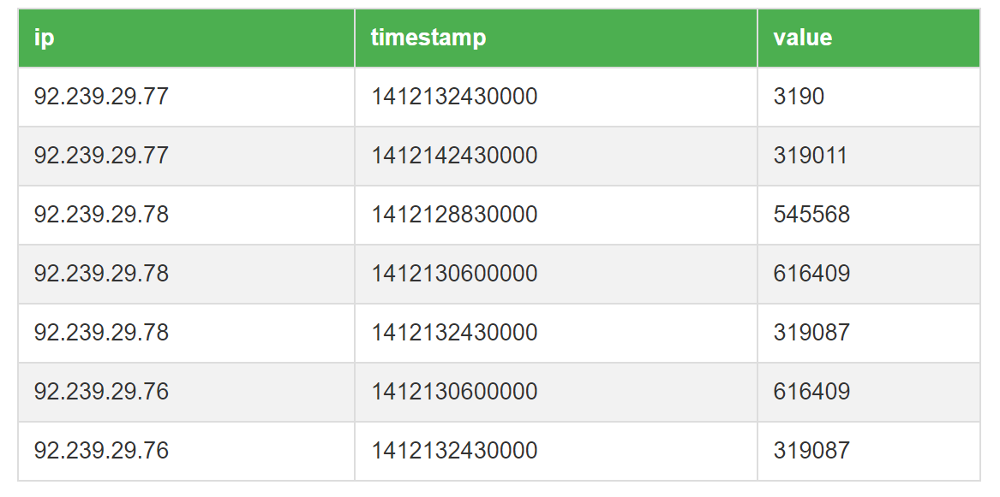

# csvtable
This project visualizes the data in a csv file as a table.

# usage
1. Put the csv file in the same directory as the html file. The first row will become the table header.
1. Start a web server: `python -m http.server 8000`
1. In your browser goto `localhost:8000`

# example output

